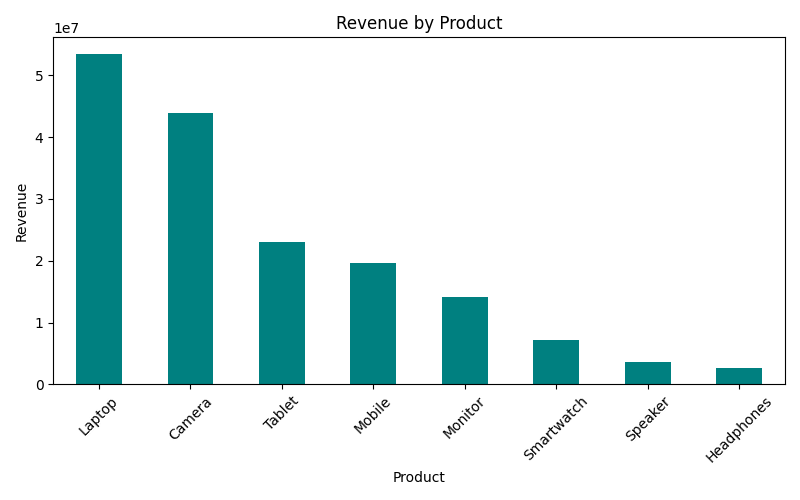
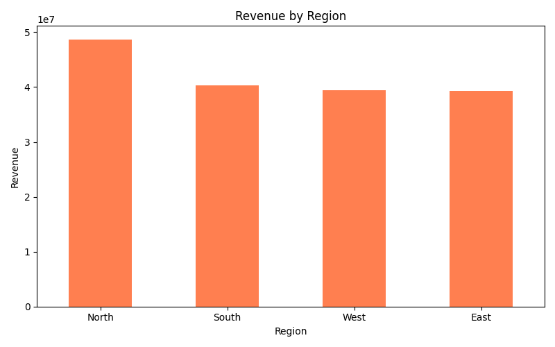
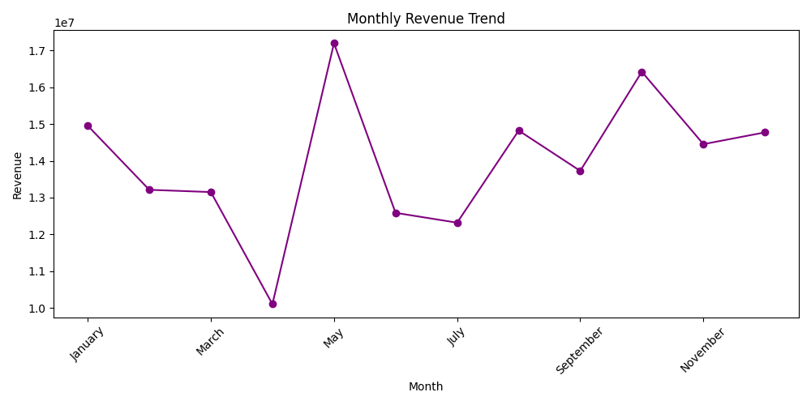
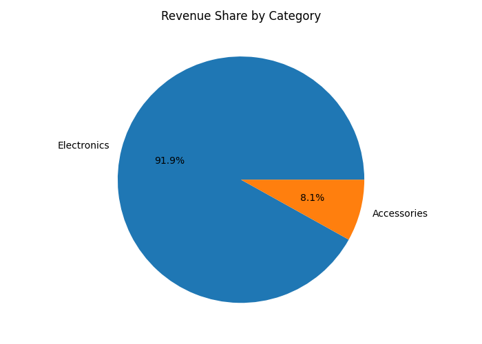

# Sales Performance Dashboard 📊

## Overview
This project analyzes a company's sales data to uncover key business insights — such as top-performing sales representatives, best-selling products, regional performance, and monthly revenue trends. The goal is to help decision-makers understand where the business is performing well and where improvements can be made.

## Tools & Technologies
- **Python** (Google Colab)
- **Pandas** – data cleaning and analysis
- **Matplotlib** – data visualization

## Dataset
The dataset (`sales_data.csv`) contains 1,200 sales records with the following columns:
- OrderID, OrderDate, Product, Category, Region, SalesRep, Quantity, UnitPrice, Discount_%, Revenue

## Analysis Performed
1. **Sales Rep Performance** – Identified top-performing sales representatives by total revenue
2. **Product Analysis** – Found the highest revenue-generating products
3. **Regional Analysis** – Compared revenue across North, South, East, and West regions
4. **Monthly Trend** – Tracked how revenue changed month-over-month across the year
5. **Category Breakdown** – Revenue share across product categories

## Key Insights
- Amit Sharma is the top-performing sales rep with the highest revenue generated
- Laptops and Monitors are the highest revenue-generating products
- North region shows the strongest overall sales performance
- Revenue shows clear monthly peaks, which can guide inventory and staffing planning

## Visualizations

## How to Run
1. Open `sales_analysis.ipynb` in Google Colab
2. Upload `sales_data.csv` to the Colab session
3. Run all cells sequentially

## Author
**Utkarshini Dwivedi**  
B.Tech CSE Student | Aspiring Data Analyst
